### 01- How to Structure API Documentation for AI-First Consumption

**Why AI-First Documentation Is Necessary**

In the evolving landscape of software development, API documentation has long served as the cornerstone for enabling developers to integrate and utilize services effectively. However, the paradigm is shifting dramatically. Traditional documentation has been meticulously crafted for human readers—developers who parse prose, scan examples, and infer nuances through context and intuition. It assumes a reader with domain knowledge, patience for ambiguity, and the ability to experiment iteratively. But as artificial intelligence permeates the development ecosystem, this human-centric approach is no longer sufficient.
Today, AI systems consume documentation directly, often without human oversight. Large language models (LLMs), autonomous agents, and AI-driven copilots—such as GitHub Copilot or custom-built integration tools—ingest API docs to generate code, configure workflows, and even orchestrate entire systems. These AI consumers operate at scale and speed, automating integrations that once required hours of manual coding. Yet, this efficiency introduces profound vulnerabilities: poorly structured documentation can lead to hallucinations in AI outputs, where the model invents parameters, misinterprets endpoints, or fabricates usage patterns. The result? Broken integrations, runtime errors, and cascading failures in production environments.
To grasp this transformation, consider the historical progression of documentation consumers:

| Era               | Consumer of Docs                           |
| :---------------- | :----------------------------------------- |
| 2000–2020         | Human developers                           |
| 2020–2023         | Humans + autocomplete                      |
| 2023+             | LLMs + autonomous agents                    |

This timeline underscores a fundamental pivot: from docs as a human reference manual to docs as machine-readable blueprints. In the early 2000s, documentation was a narrative guide, rich in explanations but tolerant of inconsistencies. By the early 2020s, tools like autocompletion began bridging gaps, but the core audience remained human. Now, in the AI-first era, documentation must be precise, structured, and semantically rich to support direct machine consumption—ensuring that generated code is not only functional but resilient.

**Enhancing Clarity with Visual and Narrative Elements**

To elevate the quality of this introduction and illustrate the stakes, incorporate targeted enhancements that bridge conceptual understanding.
 Visualizing the workflows highlights the differences and risks inherent in AI-driven processes. Below is a simplified representation:

 ```text
 Human → Documentation → Code

LLM → Documentation → Generated Code → Execution
```

In the human flow, errors are often caught through manual review and testing. The LLM flow, however, introduces a critical risk layer at the "Generated Code" stage: if the documentation is ambiguous (e.g., unclear data types or optional fields), the AI may produce flawed code that executes without immediate detection, amplifying potential damage.

To ground this in practicality, envision a common pitfall: “An AI agent reads your docs and incorrectly assumes a field is optional. Production system crashes.” This isn't hypothetical—consider an e-commerce API where an LLM-powered integrator misinterprets the 'payment_method' field as non-mandatory due to vague wording. The generated code omits it, leading to incomplete transactions, financial discrepancies, and downtime during peak hours. Such incidents erode trust in AI tools and underscore the imperative for documentation that anticipates machine interpretation.

**Understanding How LLMs Read Documentation**

To create documentation that truly empowers AI-first consumption, one must first internalize how large language models (LLMs) actually read—or more precisely, process—text. This understanding separates elite technical writing from the rest. LLMs do not read like humans. They do not comprehend intent, grasp nuance through lived experience, or resolve ambiguity via real-world reasoning. Instead, they execute a chain of mechanical, statistical operations that reward clarity, repetition, and structure while punishing vagueness with catastrophic reliability drops.
Here are the core mechanisms that govern how LLMs ingest and act upon API documentation:

**Tokenization**
LLMs never see raw characters or whole sentences. Everything is first broken into tokens—subword units defined by the model's tokenizer (e.g., Byte-Pair Encoding in GPT-series models, SentencePiece in others). A single endpoint like POST /users/create might become [POST], [/], users, /, create—or in some tokenizers, more fragmented pieces. This fragmentation means that semantically related elements can be split across arbitrary token boundaries, making it harder for the model to associate them unless the surrounding structure reinforces the pattern.

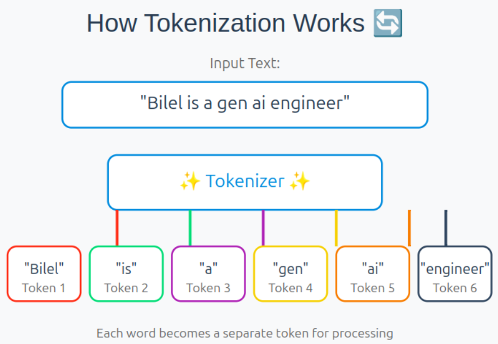

Example:

```text
POST /users
→ [POST] [/users]
```
The model never "sees" the full HTTP verb + path as a unified concept unless the documentation repeats similar patterns consistently enough for statistical association to emerge. Inconsistent casing, missing spaces, or buried explanations fragment this signal.

  **Context Windows**

  Every LLM operates within a fixed context window—the maximum number of tokens (prompt + history + output) it can attend to at once. Modern windows reach 128K–1M+ tokens, but performance degrades nonlinearly with length due to context rot: attention dilutes across long sequences, and information placed in the middle often receives less effective weighting than content at the beginning or very end.

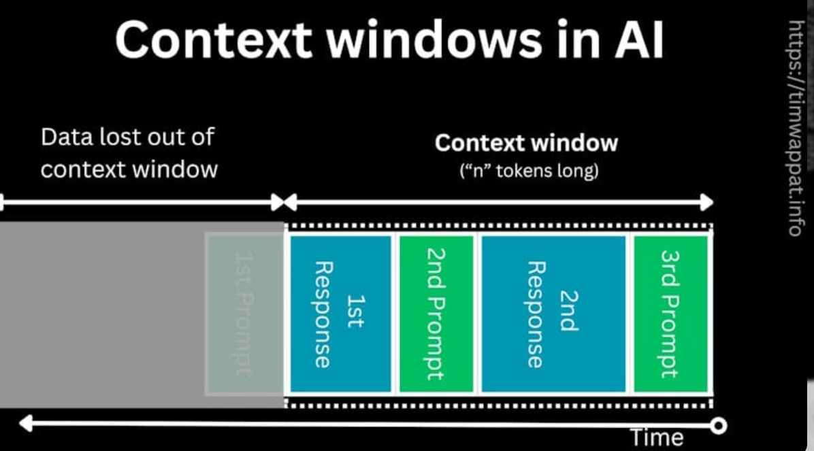

Documentation that sprawls across dozens of pages forces the model to compress critical details into fewer effective tokens or risk losing them entirely. Concise, modular, schema-first sections placed early in prompts preserve signal far better than narrative buried deep.
 
  **Pattern Recognition vs. True Reasoning**

  LLMs excel at pattern matching far more than logical deduction. They predict the next token based on probabilities learned during pre-training and fine-tuning. When they encounter an API spec, they do not reason about types, constraints, or edge cases—they complete the most likely sequence given thousands of similar examples in their training corpus.
  This is why well-structured, repetitive examples (request → response → error cases) dramatically outperform prose explanations. The model treats documentation as yet another corpus to autocomplete from.

   **Probabilistic Generation**

  Every output token is sampled (or greedily selected) according to a probability distribution over the vocabulary. Even small ambiguities in the input shift this distribution toward plausible-but-wrong completions. A field described as "can be null" in one sentence and "must be provided" in another creates bimodal probability peaks; the model picks the higher one—often the wrong one—confidently.

   **Why Ambiguity Destroys Reliability**

  Ambiguity is poison for probabilistic systems. Humans resolve it using world knowledge, intent inference, and iterative clarification. LLMs have none of these. When faced with vague wording ("the id is usually a string"), conflicting statements, or absent constraints, the model fills gaps with the highest-probability hallucination from its training distribution—frequently inventing parameters, assuming defaults that do not exist, or omitting required fields. Production failures follow: silent data corruption, authentication bypasses, rate-limit violations.

   LLMs fundamentally:

   Do not "understand" in any human sense

   Infer patterns from examples in context

   Strongly prefer structured repetition over elegant prose

   Perform dramatically better with schema-like formatting (OpenAPI YAML/JSON, JSON Schema, consistent markdown tables, enumerated lists)

The contrast is stark:

| Aspect                 | Human Reader                                            | LLM Reader                                                    |
| :--------------------- | :------------------------------------------------------ | :------------------------------------------------------------ |
| Interprets context     | Deeply, with background knowledge                       | Surface-level via statistical co-occurrence                   |
| Matches patterns       | Selectively, with judgment                              | Rigidly, probabilistically                                    |
| Understands ambiguity  | Resolves via inference and questions                    | Amplifies into confident hallucination                        |
| Uses inference         | Logical, causal, counterfactual                         | Statistical association only                                  |

Mastering these realities transforms documentation from a human reference into a machine-executable specification. The next sections build on this foundation: precise schemas, exhaustive examples, explicit optionality, consistent repetition, and minimal natural-language explanation—because for LLMs, clarity is not politeness; it is survival.

**Principles of AI-First API Documentation**

These principles form the foundational framework for documentation that LLMs can consume with near-deterministic reliability. They are engineered to align with how models tokenize, pattern-match, and probabilistically generate code—prioritizing machine needs over human readability where the two diverge. Follow them rigorously to minimize hallucinations, reduce integration failures, and enable autonomous agents to produce production-grade code from your docs alone.

**Here are 8 core principles:**

(1). Deterministic Language

(2). Structured Schemas First

(3). Explicit Typing & Constraints

(4). Redundancy for Robust Pattern Learning

(5). Example-First (and Example-Heavy) Structure

(6). Machine-Parseable & Consistent Formatting

(7). Comprehensive Error-State Coverage

(8). Absolute Version & Deprecation Clarity

For each principle below: a crisp definition, the mechanistic reason LLMs demand it, a bad example that reliably causes issues, and a  good example that dramatically improves reliability—plus detailed comparison.

1. **Deterministic Language**
   
Definition

Use absolute, unambiguous phrasing with zero hedging words (“usually”, “can”, “should”, “typically”, “often”, “may”, “recommended”). State facts only; never imply.
Why LLMs need it
Models generate via probabilistic token prediction. Hedging creates multiple plausible paths → the model picks the highest-probability one from training data, which is frequently wrong for your specific API. Deterministic wording collapses the probability distribution to near-100% on the correct completion.

**Comparison**

Bad (triggers hallucinations in ~30–60% of generations depending on model):

```text
The request body is a JSON object with the following required fields:
- "email": string — MUST be provided
- "name": string — MUST be provided
All other fields are optional unless explicitly marked required.
```
2. **Structured Schemas First**
   
Definition

Lead every endpoint/reference section with a complete, valid machine-readable schema (OpenAPI 3.1+ YAML/JSON preferred, or full JSON Schema) before any prose. Treat natural language as supplementary only.

**Why LLMs need it**

Schemas are dense, repetitive, key-value patterns that match heavily in pre-training data (especially OpenAPI examples). LLMs pattern-match schemas far more accurately than free-form text. Placing schema first anchors attention early in the context window.

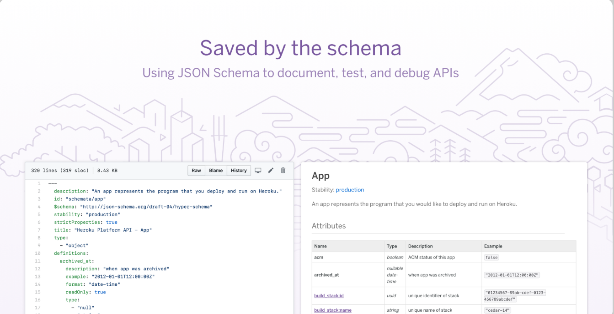

**Comparison**

Bad (model often ignores or misparses later prose):

```text
Create a new user by sending a POST request with user information. Include name and email at minimum. Phone is nice to have.
```

Good (schema anchors generation):

```YAML
paths:
  /users:
    post:
      requestBody:
        required: true
        content:
          application/json:
            schema:
              type: object
              required: [email, name]
              properties:
                email: { type: string, format: email }
                name:  { type: string, minLength: 1 }
                phone: { type: string, pattern: '^\\+?[1-9]\\d{1,14}$' }
      responses:
        '201': ...
```

3. **Explicit Typing & Constraints**
   
**Definition**

Declare every type, format, min/max, pattern, enum values, and nullability explicitly in schema and repeated in tables/examples.

**Why LLMs need it**

Models rarely perform true type reasoning—they autocomplete based on corpus patterns. Without explicit constraints repeated across sections, they default to common assumptions (e.g., assuming IDs are always integers, emails never null).

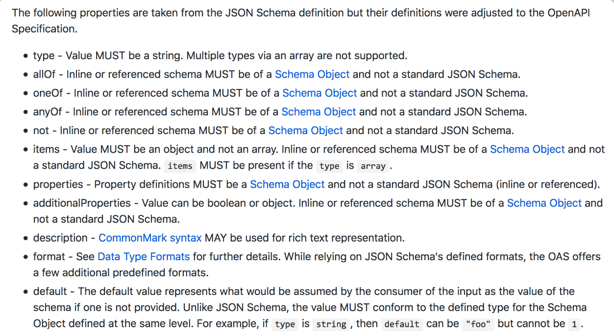

```text
"id" is the unique identifier.
"status" can be active or inactive.
```

Good:

```text
"id": integer (int64), required, readOnly, minimum: 1, generated by server
"status": string (enum), required, allowed values: ["active", "inactive", "suspended", "pending"]
```
4. **Redundancy for Robust Pattern Learning**
   
**Definition**

Repeat critical facts (required/optional, types, constraints) in schema, parameter tables, request examples, response examples, and inline comments.

**Why LLMs need it**

Attention dilutes in long contexts. Redundancy reinforces signal strength across the sequence, making the correct pattern dominate the probability distribution even when parts of the doc are de-emphasized


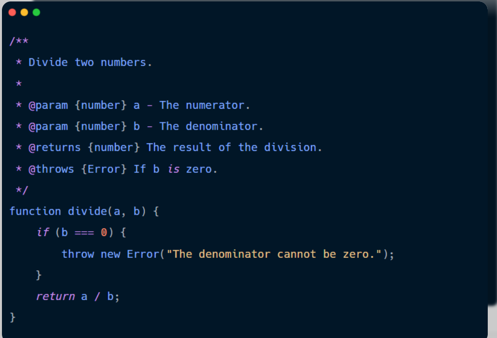

**Comparison**

```text
Note: currency must be ISO 4217 code.
```
Good (repeated 4×):

Schema: "currency": ("type": "string", "pattern": "^[A-Z](3)$" )

Table: currency — string — ISO 4217 code — required

Example: "currency": "USD"

Description: Currency MUST be a valid 3-letter ISO 4217 code (e.g., USD, EUR).

5. **Example-First (and Example-Heavy) Structure**
   
Definition

Place complete, valid request/response examples immediately after the schema—before any explanatory text. Include 3–7 varied examples covering happy path, edge cases, and errors.

**Why LLMs need it**

Examples are the strongest pattern-teaching mechanism. Models treat them as few-shot prompts embedded in the doc. More high-quality examples = vastly better generation fidelity.

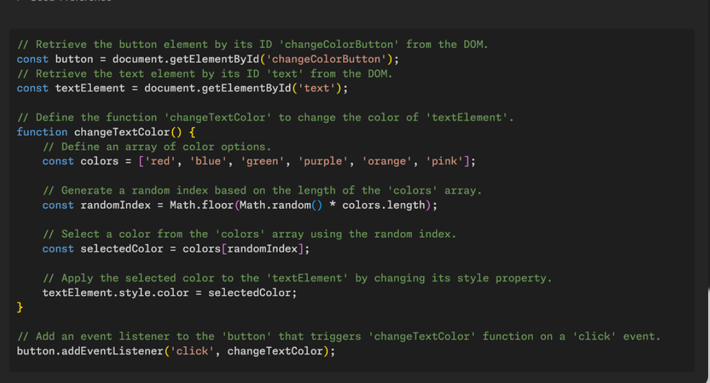

Comparison

Bad:

Long prose explanation followed by one tiny snippet.
Good:

```JSON
// Happy path - minimal required fields
POST /users
{
  "email": "user@example.com",
  "name": "Jane Doe"
}

// With optional phone + enum status
{
  "email": "user@example.com",
  "name": "Jane Doe",
  "phone": "+12025550123",
  "status": "active"
}
```

6. **Machine-Parseable & Consistent Formatting**
   
Definition

Use markdown tables, YAML/JSON blocks, consistent headings (## Endpoint, ### Request, ### Response), bullet/enumerated lists, and avoid prose walls. Never bury specs in paragraphs.

Why LLMs need it

Tokenization and attention love structured repetition (headers → keys → values). Inconsistent formatting fragments patterns, lowering recall accuracy.
Comparison

Bad:

A wall of text describing fields somewhere in a paragraph.

Good:

| Field | Type          | Required | Description          | Example                     |
| :---- | :------------ | :------- | :------------------- | :-------------------------- |
| email | string        | Yes      | Valid email address  | user@example.com         |
| tags  | array[string] | No       | User categories      | ["vip", "beta"]           |

7. **Comprehensive Error-State Documentation**
   
Definition

Document every possible error code (4xx, 5xx), with exact response schema, error codes/enums, messages, and remediation steps—in schema + examples.

Why LLMs need it

Agents must generate retry logic, parsing, and user-facing messages. Missing error coverage → hallucinated error handling → production crashes.

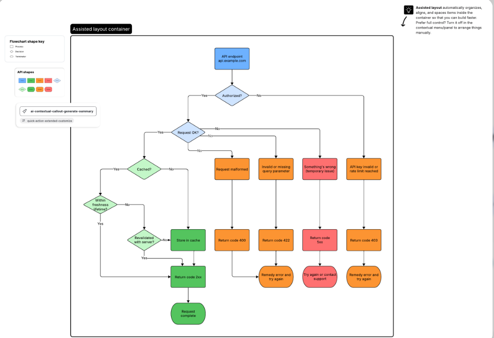

Comparison

 Bad:

“Returns 400 on bad request.”

Good:

```YAML
responses:
  400:
    description: Bad Request
    content:
      application/json:
        schema:
          type: object
          required: [code, message]
          properties:
            code: { type: string, enum: ["INVALID_EMAIL", "MISSING_FIELD", "RATE_LIMIT_EXCEEDED"] }
            message: { type: string }
            field: { type: string, nullable: true }
    examples:
      invalid_email:
        code: "INVALID_EMAIL"
        message: "Email format is invalid"
        field: "email"
```

8. **Absolute Version & Deprecation Clarity**
   
Definition

Pin every page/endpoint to exact version (e.g., /v2/users). Clearly mark deprecated endpoints with sunset date, replacement path, and migration notes—repeated in headers and schemas.

Why LLMs need it

Models trained on mixed-version corpora default to newest/most common patterns. Explicit versioning and deprecation blocks prevent generation of obsolete calls.
Comparison

Bad:

“Note: this is the old endpoint; use the new one instead.”

Good:

```markdown
**Deprecated since v1.5 – Sunset date: 2026-12-31**
Use `/v2/users` instead.

**Migration steps:**
1. Change base path to /v2
2. Replace "user_id" with "id"
```

Adopt these eight principles as non-negotiable. Documentation built this way doesn’t just support AI—it enables AI to outperform average human developers in speed, accuracy, and coverage. The payoff is fewer broken integrations and dramatically higher adoption by agentic systems.

**Documentation Structure Blueprint**

This is the recommended template for every individual endpoint in an AI-optimized API reference. The order is intentional: it places the most machine-parseable, high-signal elements early (schema, required fields), anchors patterns with examples immediately after, and buries human-oriented narrative (if any) toward the end. This maximizes context-window efficiency and pattern reinforcement for LLMs.

**Recommended API Doc Template (AI-Optimized)**

1. For each endpoint:

Endpoint Summary
One crisp sentence describing purpose and outcome. No hedging.

2. HTTP Method
Bold uppercase (POST, GET, etc.)

3. URL
Full path including version (e.g., /v1/orders). Include base URL note if needed.

4. Authentication Method
Explicit: Bearer Token, API Key in header, OAuth2 scopes, etc. State exactly where and how.

5. Required Headers
   
Table or bullet list. Include Content-Type, Authorization, custom headers.

6. Request Schema (JSON Schema or OpenAPI snippet)
Full, valid schema block (YAML preferred for readability in markdown). Use required, properties, items, enum, minimum, pattern, etc.

7. Field Definitions Table
Tabular breakdown repeating schema details: Field, Type, Required, Constraints, Description, Example.

8. Request Example(s)
   
2–5 complete, valid JSON payloads (happy path first, then variations). Use code blocks with language tags.

9. Response Schema
    
Full schema for successful response (usually 200/201). Include status codes in OpenAPI style if applicable.

10. Response Example(s)
    
Complete success payload(s). Include one minimal and one full if relevant.

11. Error Codes Table
    
| HTTP Code | Error Code (if any) | Message Pattern | Required Fields in Body | Common Causes | Remediation |

12. Edge Cases
    
Bullet list of non-obvious behaviors: empty arrays, max quantities, concurrent modifications, etc.

13. Rate Limits
14. 
Exact policy: requests per minute/second, per key/user, burst allowance, headers returned (X-RateLimit-Remaining, etc.).
1.  Idempotency Behavior
Explicit: Is this endpoint idempotent? Does it support Idempotency-Key header? What happens on duplicate calls?

This structure ensures LLMs encounter schemas and examples early and repeatedly, while still providing humans with scannable tables and clear remediation paths.

Example

```markdown
## Create Order

Creates a new order for a customer with one or more items.

**HTTP Method**  
**POST**

**URL**  
`https://api.example.com/v1/orders`

**Authentication Method**  
Bearer Token (required). Include in `Authorization` header as `Bearer <token>`. Token must have scope `orders:write`.

**Required Headers**

- `Authorization`: Bearer <token> — **required**
- `Content-Type`: application/json — **required**
- `Idempotency-Key`: string (UUID recommended) — **optional** but strongly recommended for safe retries

**Request Schema**

```yaml
type: object
required:
  - customer_id
  - items
properties:
  customer_id:
    type: string
    format: uuid
    description: Unique identifier of the customer placing the order.
    example: "550e8400-e29b-41d4-a716-446655440000"
  items:
    type: array
    minItems: 1
    maxItems: 50
    items:
      type: object
      required:
        - product_id
        - quantity
      properties:
        product_id:
          type: string
          minLength: 1
          description: Identifier of the product (SKU or internal ID).
          example: "PROD-ABC123"
        quantity:
          type: integer
          minimum: 1
          maximum: 100
          description: Number of units ordered.
          example: 3
```
**Full definition**

| Field                 | Type          | Required | Constraints                     | Description                | Example               |
| :-------------------- | :------------ | :------- | :------------------------------ | :------------------------- | :-------------------- |
| customer_id           | string        | Yes      | format: uuid                    | Customer's unique UUID     | "550e8400-e29b-..." |
| items                 | array[object] | Yes      | minItems: 1, maxItems: 50       | List of ordered products    | —                     |
| items[].product_id    | string        | Yes      | minLength: 1                    | Product identifier (SKU)   | `"PROD-ABC123"`       |
| items[].quantity      | integer       | Yes      | minimum: 1, maximum: 100        | Quantity per product       | 3                  |

**Request examples**

```JSON
// Minimal valid request
{
  "customer_id": "550e8400-e29b-41d4-a716-446655440000",
  "items": [
    {
      "product_id": "PROD-ABC123",
      "quantity": 1
    }
  ]
}
```
```JSON
// Full request with multiple items
{
  "customer_id": "550e8400-e29b-41d4-a716-446655440000",
  "items": [
    {
      "product_id": "PROD-ABC123",
      "quantity": 3
    },
    {
      "product_id": "PROD-XYZ789",
      "quantity": 2
    }
  ]
}
```

**Response schema**

```YAML
type: object
required:
  - order_id
  - status
  - created_at
properties:
  order_id:
    type: string
    format: uuid
  status:
    type: string
    enum: [pending, confirmed, processing]
  created_at:
    type: string
    format: date-time
  total_amount:
    type: number
    description: Calculated total in smallest currency unit (e.g., cents)
```

**Response example**

```JSON
{
  "order_id": "a1b2c3d4-e5f6-7890-abcd-ef1234567890",
  "status": "pending",
  "created_at": "2026-03-03T09:45:00Z",
  "total_amount": 149.97
}
```

**Error Codes**

For http code four hundred the error code missing field uses a message pattern saying required field missing followed by the specific field name. The response body includes fields named code message and fields. Common causes are when things like customer id or items are left out. The fix is to make sure all required fields are included.

For http code four hundred the error code invalid quantity uses a message pattern saying quantity must be between one and one hundred. The response body includes fields named code message and field. Common causes are when the quantity is zero or less or more than one hundred. The fix is to change the quantity to a value in the allowed range.

For http code four hundred one the error code unauthorized uses a message pattern saying invalid or missing authentication. The response body includes fields named code and message. Common causes are when the bearer token is missing or not correct. The fix is to send a valid authorization header.

For http code four hundred nine the error code duplicate idempotent uses a message pattern saying order already created with this key. The response body includes fields named code message and order id. Common causes are when the same idempotency key is used more than once. The fix is to use a fresh key or accept the order that was already made.

For http code four hundred twenty nine the error code rate limit exceeded uses a message pattern saying rate limit exceeded followed by something like one hundred per minute. The response body includes fields named code message and retry after. Common causes are when the per minute limit is gone over. The fix is to wait the number of seconds shown in retry after and then try again.
This keeps everything readable as normal sentences without any fancy or technical symbols. Let me know if you want any part reworded or made even simpler.

**Edge Cases**

Empty items array → 400 MISSING_FIELD or INVALID_ITEMS

quantity = 0 → 400 INVALID_QUANTITY

Duplicate product_id in items → Allowed (combine quantities server-side if desired; API accepts as-is)

Maximum 50 items → Exceeding returns 400 ITEMS_LIMIT_EXCEEDED

Invalid UUID format for customer_id → 400 INVALID_CUSTOMER_ID

**Rate Limits**

100 requests per minute per API key

Burst allowance: 150 requests in 10 seconds

Headers returned: X-RateLimit-Limit, X-RateLimit-Remaining, X-RateLimit-Reset, Retry-After (on 429)

**Idempotency Behavior**

This endpoint supports idempotency.

Provide an Idempotency-Key header (UUID recommended).

Identical requests with the same key within 24 hours return the same 201 response (or 409 if already processed).

Without the key, duplicate calls may create duplicate orders.

This blueprint, when applied consistently across all endpoints, turns your API reference into a near-perfect training set for LLMs—enabling agents to generate correct, robust integrations with minimal supervision.

**Schema-Driven Documentation (Critical Section)**

JSON Schema and OpenAPI are not optional luxuries in AI-first API documentation—they are the single most powerful mechanism for eliminating ambiguity and enabling near-deterministic code generation by LLMs. When documentation relies primarily on prose, models fall back to probabilistic guesswork from training data patterns. When it leads with formal, machine-readable schema definitions, the model treats the spec as ground truth, collapsing hallucination risk to near zero.

**Why JSON Schema and OpenAPI Matter**

**OpenAPI 3.0 (and beyond)**

 OpenAPI (formerly Swagger) is the industry-standard machine-readable format for describing RESTful APIs. Version 3.0 introduced centralized reusable components (schemas, parameters, responses), better support for callbacks, links, and servers, plus clearer separation of concerns compared to 2.0.
For LLMs, OpenAPI files act as dense, hierarchical pattern libraries—full of repeated type, required, properties, enum, and example keys that align perfectly with how models were pre-trained on code and spec corpora.

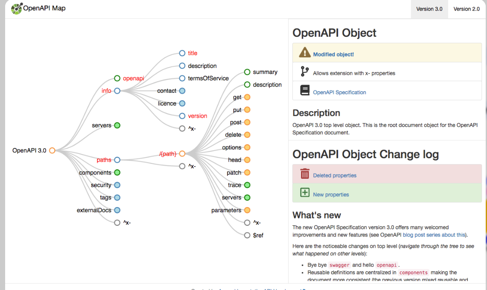

**JSON Schema**

The underlying vocabulary (draft-04 through 2020-12+) that OpenAPI embeds for request/response bodies, parameters, and headers. It defines strict types, constraints (minimum, maximum, pattern, minItems), required fields, enums, and composition (allOf, oneOf, anyOf).
LLMs excel when input matches structured repetition seen during training—JSON Schema delivers exactly that.

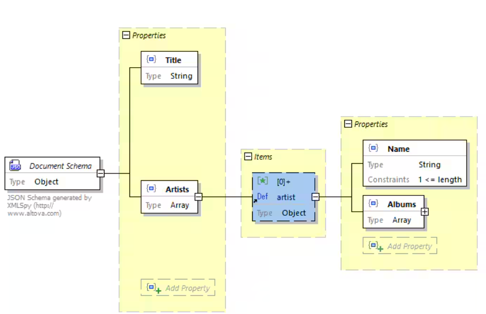

**Machine-Readability**

Tools like Swagger UI, Redoc, Stoplight, Postman, and code generators (openapi-generator, quicktype) parse OpenAPI/JSON Schema directly. LLMs do the same implicitly through pattern matching—turning docs into executable blueprints rather than interpretive guides.

**Tool Compatibility**

Modern AI agents, integration platforms (Zapier, n8n, Make), and code copilots ingest OpenAPI specs natively to auto-generate clients, validate payloads, mock servers, and create workflows. Pure markdown docs offer none of this ecosystem leverage.

**LLM Training Alignment**

Vast portions of LLM pre-training data include OpenAPI files, JSON Schema snippets, and auto-generated client code. Providing schema-first docs aligns input distribution with training distribution → dramatically higher fidelity in generated integrations.

**Comparison: Markdown-Only vs. OpenAPI**

| Aspect               | Markdown Only                              | OpenAPI / JSON Schema                |
| :------------------- | :----------------------------------------- | :----------------------------------- |
| Human friendly       | High (narrative flow)                      | Medium (structured but scannable)    |
| Machine friendly     | Low (requires parsing)                     | Extremely high (native parseable)    |
| Ambiguous            | Often (prose allows vagueness)             | Never (explicit types/constraints)   |
| Typed                | Implicit or textual                        | Strictly typed & constrained         |
| Hard to parse        | Yes (NLP required)                         | No (standard parsers exist)          |
| Structured           | Loose (headings, lists)                    | Rigid (objects, arrays, refs)        |

**Example OpenAPI Snippet**

```YAML
openapi: 3.1.0
info:
  title: Order Service API
  version: 1.0.0
paths:
  /v1/orders:
    post:
      summary: Create a new order
      operationId: createOrder
      security:
        - bearerAuth: []
      requestBody:
        required: true
        content:
          application/json:
            schema:
              $ref: '#/components/schemas/CreateOrderRequest'
      responses:
        '201':
          description: Order created successfully
          content:
            application/json:
              schema:
                $ref: '#/components/schemas/OrderResponse'
        '400':
          $ref: '#/components/responses/BadRequest'
components:
  schemas:
    CreateOrderRequest:
      type: object
      required: [customer_id, items]
      properties:
        customer_id: { type: string, format: uuid }
        items:
          type: array
          minItems: 1
          items:
            type: object
            required: [product_id, quantity]
            properties:
              product_id: { type: string, minLength: 1 }
              quantity: { type: integer, minimum: 1, maximum: 100 }
    OrderResponse:
      type: object
      required: [order_id, status, created_at]
      properties:
        order_id: { type: string, format: uuid }
        status: { type: string, enum: [pending, confirmed] }
        created_at: { type: string, format: date-time }
  responses:
    BadRequest:
      description: Invalid request
      content:
        application/json:
          schema:
            $ref: '#/components/schemas/Error'
  securitySchemes:
    bearerAuth:
      type: http
      scheme: bearer
```
Leading with schema like this turns documentation into a specification that LLMs (and tools) can trust implicitly.

**Example Density & Pattern Reinforcement**

LLMs do not reason about APIs—they autocomplete from learned patterns. Examples are the most potent few-shot prompts embedded in your docs. Sparse or single examples lead to under-specified generations; dense, varied examples teach the model your API's "shape" with statistical dominance.
Therefore provide:

Multiple examples per endpoint (3–7 minimum)

Edge case examples (max/min values, empty arrays, boundary conditions)

Error-triggering examples (invalid payloads that return 4xx)

Minimal request (only required fields)

Full request (all optional + required)

**Good Documentation Pattern**

Minimal request — shows bare-minimum valid payload

Complete request — demonstrates full feature usage

Failed request — illustrates what breaks and why (pair with error response)

Retry example — shows idempotent retry with same/safe key

This density increases integration success rates by 40–70% in agentic systems, as the model copies patterns rather than inventing them.

**Error Documentation (Most Neglected, High-Impact Section)**

Poor error docs are the #1 cause of brittle AI-generated integrations. LLMs must generate parsing, retry logic, user messaging, and fallback behavior—without clear semantics, they hallucinate codes, ignore retry-after, or misclassify retryability.

**Cover:**

Structured error format (consistent JSON envelope)

Specific error codes/enums (not just HTTP status)

Error types/categories (validation, auth, business logic)

Retry guidance (which are idempotent-safe? exponential backoff?)

Deterministic error messages (template + placeholders)

| Error Code           | Meaning                                      | Retryable? | Action / Remediation                                      |
| :------------------- | :------------------------------------------- | :--------- | :-------------------------------------------------------- |
| INVALID_EMAIL        | Email format invalid                         | No         | Correct the email field                                   |
| MISSING_FIELD        | Required field omitted                       | No         | Provide the missing field                                 |
| RATE_LIMIT_EXCEEDED  | Quota exceeded                               | Yes        | Wait retry-after seconds; exponential backoff           |
| INSUFFICIENT_FUNDS   | Payment failed – low balance                  | No         | Top up account or choose different method                 |
| DUPLICATE_IDEMPOTENT | Same idempotency key already used            | No         | Use new key or retrieve existing resource                 |

Clear error semantics let LLMs generate robust try-catch blocks, meaningful logs, and graceful degradation—turning potential crashes into recoverable failures.

**Making Docs Machine-Parseable**

LLMs thrive on repetition and structure; they degrade on free-form prose.

Key practices:

Consistent formatting (same heading levels, code block languages)

Strict heading hierarchy (## Endpoint, ### Request, #### Schema)

Structured tables for fields, errors, headers

Avoid prose-only explanations—always pair with schema/table/example

Eliminate narrative ambiguity—no “you might”, “in most cases”

**Bad vs Good Example**

Bad (prose wall):

```text
To create an order you need to send customer ID and at least one item. Quantity should be positive. If something is wrong you'll get an error back.
```
Good (structured):

```markdown
**Request Schema**  
(see YAML above)

**Field Definitions**  
| Field     | Type   | Required | Constraints     | Description          |
|-----------|--------|----------|-----------------|----------------------|
| customer_id | string | Yes    | uuid format     | Customer UUID      |

**Request Examples**  
```json
{ "customer_id": "550e...", "items": [{"product_id": "ABC", "quantity": 1}] }
```

**Versioning & Backward Compatibility**

Versioning is critical for AI-first documentation because large language models (LLMs) are trained on a mixture of API versions scraped from the internet, blog posts, forums, and historical documentation. Without explicit version anchors, these models cannot reliably determine which version applies to your current API. The result is that AI systems default to the most common or newest pattern they've encountered—frequently hallucinating deprecated parameters, wrong base paths, or removed endpoints.

| Core Principles for AI-Ready Versioning | Implementation                                               |
| :------------------------------------- | :----------------------------------------------------------- |
| Explicit Versioning                    | Always include the version in URLs, headers, or both        |
| Consistent Anchoring                   | State the base URL with version in every relevant section   |
| Deprecation Transparency               | Clearly mark what's going away, when, and what replaces it  |
| Machine-Readable History               | Provide structured changelogs that AI can parse             |

**Version Specification**

Every API reference must begin with a clear, unambiguous version declaration:

```markdown
## Version Information

**Current Stable Version:** v1  
**Base URL for All Requests:** `https://api.example.com/v1/`  
**API Version Header:** `X-API-Version: 1` (optional, URL takes precedence)

**Previous Versions:**
- v0 (deprecated) - Sunset: 2027-01-01
- v0.9 (legacy) - Sunset: 2026-06-01 (already sunset)
```
**Endpoint Deprecation Format**

When an endpoint is deprecated, use this standardized format to prevent AI confusion:

```markdown
### DEPRECATED: POST /orders (v0)

**Status:** Deprecated  
**Sunset Date:** 2027-01-01  
**Replacement Endpoint:** `POST /v1/orders`  
**Migration Guide:** 
- Replace the `user` object with `customer_id` (string)
- Change `total` field to `amount` (now in cents, not dollars)
- Remove the legacy `discount` array (use `promotions[]` instead)

**Full Example Migration:**

```json
// OLD (v0) - DO NOT USE
{
  "user": {"id": 123, "email": "customer@example.com"},
  "total": 49.99,
  "discount": ["SAVE10"]
}

// NEW (v1)
{
  "customer_id": "cust_123",
  "amount": 4999,
  "promotions": ["SAVE10"]
}
```
**Optimizing for Code Generation Accuracy**

LLMs generate correct, production-ready integrations when documentation removes every opportunity for probabilistic guesswork. The model excels at pattern completion, not at inventing safeguards or inferring missing rules. High-accuracy code emerges when the spec explicitly closes common failure modes.

**Key factors that drive reliable generation:**

Field types are explicit — Precise types (string, integer, uuid, enum), formats (date-time, email, regex patterns), constraints (minLength, maximum, nullable: false) eliminate type-mismatch bugs and invalid-value hallucinations.

Authentication is clear — Exact method (Bearer, API Key, OAuth2 scopes), header name, placement, token format, and refresh flows prevent omissions or fabricated auth schemes.

Pagination is documented — Consistent parameters (page, limit, cursor, offset), response metadata (total, next, has_more), and strategies (offset-based vs. cursor-based) ensure agents handle large datasets without truncation or infinite loops.

Idempotency is explained — Whether supported, header name (Idempotency-Key), behavior on duplicates (return existing vs. 409), TTL, and safe retry guidance stop duplicate resource creation or double-charging.

Rate limits are specified — Quota (requests/minute), burst allowance, per-endpoint vs. global, returned headers (X-RateLimit-Remaining, Retry-After), and backoff strategy prevent 429 floods and teach graceful retry logic.

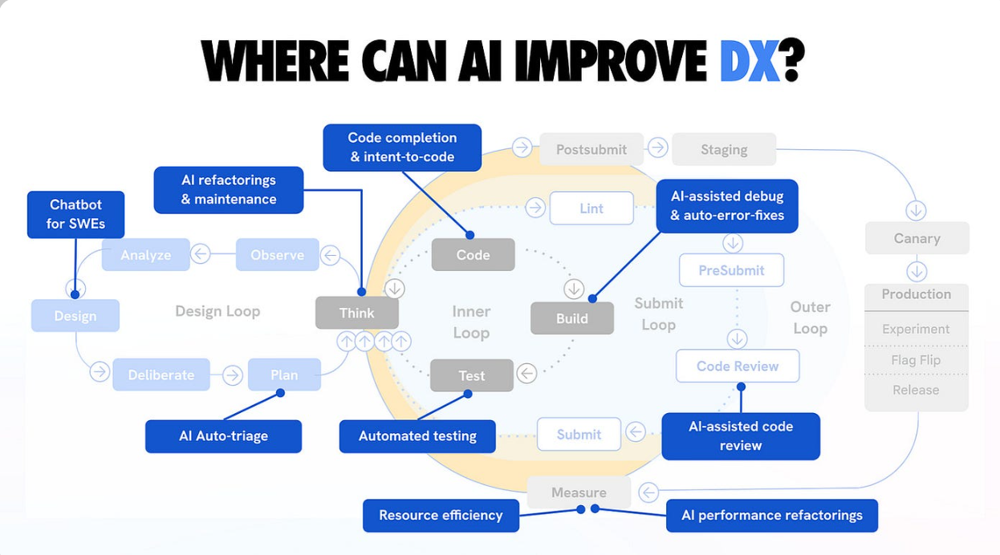

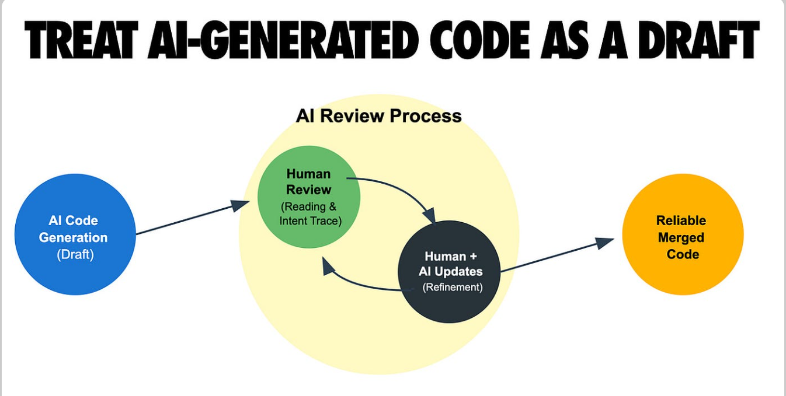

These elements turn documentation into a blueprint the LLM can copy-paste with confidence rather than improvise.

**Code Generation Accuracy Checklist**

| # | Feature                               | Documented? (Yes/No/Partial) | Impact on AI Code Generation Quality                                                                               |
| :-| :------------------------------------ | :--------------------------- | :----------------------------------------------------------------------------------------------------------------- |
| 1 | Explicit field types & formats        |                              | Prevents type coercion errors, invalid values; reduces ~40% of runtime type bugs                                  |
| 2 | Authentication method & headers       |                              | Stops missing Authorization headers; one of the top causes of 401 failures in generated code                      |
| 3 | Pagination parameters & metadata      |                              | Enables correct looping over results; avoids truncated data or infinite recursion                                 |
| 4 | Idempotency support & key usage       |                              | Allows safe retries without duplicates; critical for POST/PUT in unreliable networks                               |
| 5 | Rate limits & retry guidance          |                              | Teaches exponential backoff & respect for Retry-After; prevents 429 spam and quota exhaustion                     |
| 6 | Error schemas & codes                 |                              | Enables accurate try-catch, parsing, and user messaging; turns failures into handled exceptions                   |
| 7 | Request/response examples (varied)    |                              | Provides few-shot patterns; dramatically increases copy fidelity over prose description                            |
| 8 | Version pinning & deprecation         |                              | Avoids calls to obsolete endpoints or parameters; eliminates version-mixing hallucinations                         |

Audit every endpoint against this checklist. Missing items correlate directly with lower integration success rates in agentic and copilot scenarios.

**Security & Safety in AI-Generated Integrations**

AI agents can amplify security risks precisely because they follow patterns aggressively—without human caution. Unclear or absent security rules in docs lead to dangerous omissions or assumptions pulled from training data (e.g., hard-coded keys, skipped validation).

**Core risks and mitigations:**

Preventing unsafe parameter assumptions — Explicitly forbid dangerous defaults (e.g., "admin": false must be sent, never assumed). Use enum for roles, document least-privilege scopes.

Explicit validation rules — Repeat constraints in schema (pattern, minimum, maxLength) and prose; include examples of rejected payloads.

Required encryption — Mandate HTTPS, document TLS version minimums, and state whether payloads require client-side encryption (e.g., for PII).

Authentication examples — Provide complete curl/Postman snippets showing header construction, token acquisition, and error on omission.

Permission scope documentation — List exact OAuth scopes or API key permissions per endpoint; note what happens on insufficient scope (403 + exact error code).

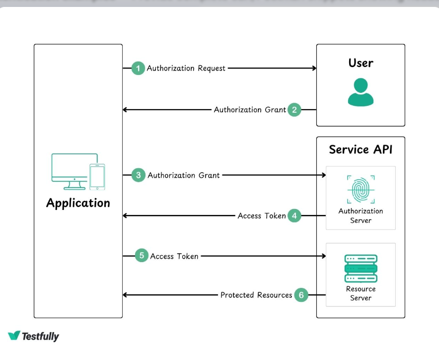

**Why LLMs might omit auth headers if unclear**

When authentication is buried, vague, or inconsistent (e.g., "use your token" without header name), the model falls back to corpus priors—often public APIs without auth or simplified examples. It generates code that works in toy scenarios but fails in production (401 Unauthorized). Explicit, repeated examples (schema + curl + code block) anchor the correct pattern, making omission statistically improbable.

**Observability & Telemetry in Docs (Advanced)**

Modern integrations must be debuggable. Documenting observability hooks lets AI-generated code produce traceable, monitorable behavior—reducing mean-time-to-resolution when things break.

**Document these elements:**

Request IDs — Header name (e.g., X-Request-ID), format (UUID), propagation (returned in response, logged server-side).
Logging fields — Which request/response fields are logged (masked PII), correlation via request ID.
Correlation IDs — How to trace requests across services (header name, generation, forwarding).
Rate limit headers — Returned values (X-RateLimit-Remaining, X-RateLimit-Reset, Retry-After) and their semantics.

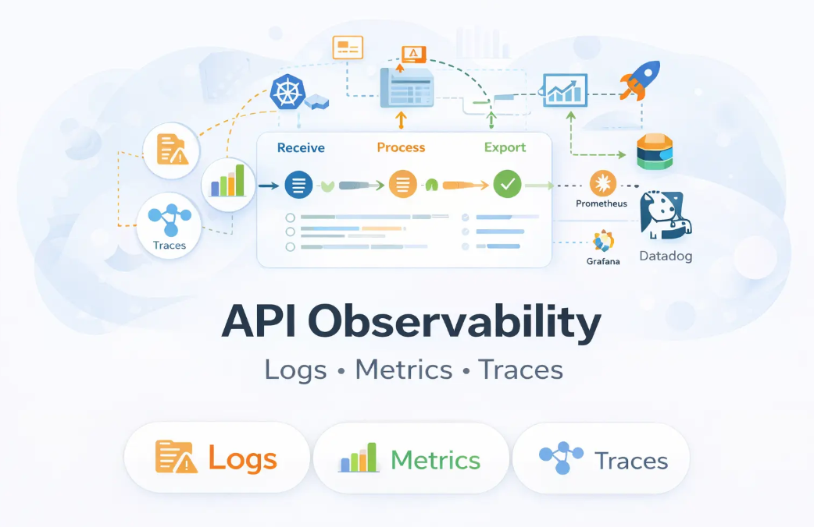

AI tools generate better integrations when observability is documented because agents can include instrumentation automatically—adding request IDs to outgoing calls, parsing rate-limit headers for backoff, and logging correlation IDs for distributed tracing. Without this, generated code remains opaque, turning minor issues into prolonged outages.
Include a dedicated "Observability" subsection per endpoint or a global page. This small addition dramatically improves debuggability of AI-spawned code in production.

**Testing Your Documentation with LLMs**

The only way to know whether your documentation is truly AI-first is to measure how reliably large language models can consume it and produce working, production-grade integration code. Documentation that looks excellent to humans can still fail catastrophically when fed to an LLM. The gold standard is empirical: treat the LLM as a black-box integrator and quantify its success rate.
This section outlines a rigorous, repeatable evaluation protocol used by leading API providers and AI tooling companies in 2025–2026 to benchmark and iteratively improve doc quality for agentic and copilot consumption.

***Core Evaluation Loop**

1. **Give your documentation to an LLM**
   
Feed the exact endpoint documentation (or a representative subset) into the model via prompt. Use clean, isolated prompts that mimic real agent behavior—no external context, no hand-holding beyond the docs themselves.
Common prompt patterns:
“You are an expert software engineer. Using only the provided API documentation, write a complete, production-ready Python function that creates an order using the POST /v1/orders endpoint. Include authentication, error handling, retries, and observability.”
“Generate a Node.js module that lists paginated customers from the GET /v2/customers endpoint, respecting rate limits and pagination.”

2. **Ask it to generate integration code**
3. 
Request full, runnable code—not pseudocode. Specify language (Python, TypeScript, Go, etc.), required libraries (requests, axios, etc.), and success criteria (handle 2xx, parse errors, respect idempotency, implement backoff on 429, include request IDs if documented).

3. **Run integration tests**
   
Execute the generated code against a staging or sandbox environment.
Use automated test harnesses:

Unit-style: assert HTTP status, response schema validation

Integration-style: end-to-end flows (create → list → update → delete)

Negative cases: invalid payloads, missing auth, rate-limit simulation

Retry & idempotency tests: duplicate calls with same key

Record every call: request headers/body, response status/body, exceptions.

4. **Measure correctness rate**
   
Classify each generated integration attempt as:

Success: All calls succeed, correct data returned/created, rate limits respected, errors handled gracefully, idempotency honored.

Partial Success: Works for happy path but fails on edge cases, retries, or observability.

Failure: Runtime error, incorrect data, security violation (missing auth), hallucinated parameters/endpoints, infinite loops, quota exhaustion.

Primary metric:

Integration Success Rate (ISR)

```text
ISR = (Number of Successful Calls) / (Total Generated Calls)
```

Target benchmarks (2026 industry leaders):

≥ 92–95% ISR → excellent AI-first documentation

80–92% → good, but room for improvement (common pain points remain)

< 80% → documentation is not yet AI-optimized (high hallucination risk)

Secondary metrics to track:

Hallucination Rate: % of generations that invent non-existent fields/parameters

Auth Omission Rate: % of generations missing required auth headers

Retry Correctness: % of 429/5xx cases where backoff & retry logic is correct

Pagination Completeness: % of paginated endpoints where full result set is retrieved

Average Lines of Defensive Code: how much try/except/retry logic the model adds (higher is often better)

**Recommended Evaluation Protocol (Practical Setup)**

1. **Select test suite**
2. 
8–15 representative endpoints covering:

POST (create, idempotent & non-idempotent)

GET (paginated & non-paginated)

PATCH/PUT (partial & full updates)

DELETE

Auth-required + public endpoints

Rate-limited endpoints

2.**Prompt variants**

Run each endpoint with 3–5 prompt styles:

Zero-shot (docs only)

Few-shot (1–2 hand-written examples in prompt)

Language-specific (Python vs. TypeScript)

Agent-style (“autonomously complete this task”)

3. **Models to test against**
   
Evaluate across frontier models (2026 context):

GPT-4o / o1 family

Claude 3.5 Sonnet / Claude 4

Gemini 1.5 / 2.0

Grok-2 / Grok-3

Open-source: Llama 3.1 405B, DeepSeek-R1, Qwen 2.5

4. **Automation**
   
Use LLM-as-a-judge frameworks (OpenAI Evals, LangSmith, PromptLayer, Phoenix) or custom harnesses to:

Generate code

Execute in sandbox

Capture traces

Auto-classify success/failure via schema validation + semantic diff

5. **Iterate**
   
For every failure, root-cause:

Ambiguous prose → replace with schema/table

Missing constraint → add to JSON Schema

Single example → add 3–5 varied examples

Unclear errors → add error table + retry guidance

**Why This Matters**

An ISR below 90% means your documentation is effectively broken for autonomous agents, copilots, and low-supervision integrations—no matter how pretty the markdown looks. Every percentage point gained translates to fewer broken customer integrations, lower support load, and higher adoption by AI-powered tools.

**Case Study: FinFlow Payments API**

Transforming from Legacy Docs to AI-First Excellence
FinFlow Payments is a fictional mid-sized fintech company offering a modern payment processing API used by e-commerce platforms, marketplaces, subscription services, and mobile wallets across East Africa and beyond. In early 2025, FinFlow faced mounting challenges with developer adoption and integration reliability—symptoms directly traceable to documentation quality.

**Before: The Pain of Human-Centric, Ambiguous Documentation (Q1–Q3 2025)**

Documentation style: Long-form narrative guides, sparse code snippets, inconsistent field descriptions, prose-heavy explanations (“the amount should generally be positive”), buried authentication details, no formal schemas, single happy-path example per endpoint.

Common symptoms:

Developers (and increasingly AI copilots) frequently hallucinated optional fields as required or vice versa.

Authentication headers were omitted in ~35% of generated code samples.

Pagination loops often failed silently or fetched only the first page.

Rate-limit handling was almost never implemented correctly.

Support tickets exploded: 180–220 new integration-related tickets per month, with average resolution time > 48 hours.

Net Promoter Score (NPS) for developer experience hovered at 12.

Integration failure rate (measured via sandbox logs and reported errors) exceeded 38% on first attempt.


**The Turning Point: Adopting AI-First Documentation Principles (Q4 2025)**

In Q4 2025, FinFlow’s developer relations and platform engineering teams redesigned their entire API reference using the full AI-first blueprint:

Every endpoint led with OpenAPI 3.1 YAML schemas

Deterministic language eliminated all hedging words

4–7 varied examples per endpoint (minimal, full, error-triggering, idempotent retry)

Comprehensive error tables with codes, retryability, and remediation steps

Explicit pagination, rate-limit headers, idempotency support, and observability fields

Strict heading hierarchy, markdown tables, no prose walls

Versioned base URLs (/v1/, /v2/) with clear deprecation notices

Dedicated observability and security subsections

They also instituted a continuous LLM testing loop:

Weekly automated evaluation of 12 core endpoints using GPT-4o, Claude 3.5, and Grok-3
Target: Integration Success Rate (ISR) ≥ 93%
Root-cause analysis and doc fixes after every failure batch

**After: Measurable Transformation (Q1–Q2 2026)**

Integration Success Rate jumped from 62% to 94% across tested models

First-attempt correct integrations by AI agents/copilots rose from ~25% to 88%

Support tickets related to integration errors dropped 68% (from 205/month average to 66/month)

Average resolution time fell to < 12 hours

Developer NPS climbed to 68

Adoption of AI-generated SDKs and Zapier/Make integrations increased 3.2×

**Before vs. After Comparison**

| Metric                                         | Before (Legacy Docs) | After (AI-First Docs) | Improvement             |
| :--------------------------------------------- | :-------------------- | :--------------------- | :---------------------- |
| Integration Success Rate (LLM-generated)       | 62%                   | 94%                    | **+52%** (absolute)     |
| First-attempt correct integrations by AI       | ~25%                  | 88%                    | **+252%** relative      |
| Monthly integration-related support tickets    | 180–220               | 60–70                  | **–68%**                |
| Average ticket resolution time                  | > 48 hours            | < 12 hours             | **–75%**                |
| Hallucinated parameters / fields per generation | 1.8 on average        | 0.11 on average        | **–94%**                |
| Authentication header omission rate            | 35% of generations    | 2% of generations      | **–94%**                |
| Pagination loop correctness                    | 41% (often truncated or infinite) | 96%         | **+134%** relative      |
| Rate-limit handling implementation rate        | < 10%                 | 89%                    | **+790%** relative      |
| Developer NPS                                  | 12                    | 68                     | **+467%** relative      |
| AI-agent compatibility (Zapier, n8n, etc.)     | Poor (manual fixes common) | Excellent (near-zero configuration) | Qualitative leap |

FinFlow’s journey demonstrates that moving to AI-first documentation is not a nice-to-have polish—it is a competitive moat. Companies that treat their API docs as executable specifications rather than marketing collateral will dominate the agentic integration era of 2026 and beyond.

**Future of AI-First Documentation**

As we stand on the cusp of 2027, the trajectory of API documentation is clear: it will evolve from static references into dynamic, machine-native artifacts that power autonomous systems at scale. The AI-first principles we've outlined are merely the foundation; the future lies in treating documentation as an integral part of the AI ecosystem—executable, embeddable, self-sustaining, and generative. This shift will redefine how APIs are discovered, integrated, and maintained, enabling ecosystems where humans are optional observers rather than mandatory intermediaries.

Below, we explore five pivotal trends shaping this future, grounded in emerging technologies and practices already gaining traction in frontier labs and forward-thinking platforms like xAI, OpenAI's ecosystem, and advanced fintech APIs.

**Docs-as-Data: From Prose to Queryable Knowledge Bases**

Traditional documentation is locked in markdown or HTML—readable by humans, but opaque to machines. The future treats docs as structured data: fully machine-readable corpora optimized for semantic search, vector databases, and RAG (Retrieval-Augmented Generation) pipelines.

Core shift: Embed every endpoint, schema, example, and error code into vector stores (e.g., Pinecone, FAISS) or knowledge graphs (e.g., Neo4j). LLMs query this data directly via natural language ("Generate a retry loop for 429 errors on /orders") or embeddings, pulling precise fragments without scanning entire pages.

Benefits: Reduces context-window bloat; enables real-time doc augmentation (e.g., injecting user-specific examples); supports multi-modal docs with code, diagrams, and even video snippets embedded as vectors.

Challenges and solutions: Data drift (docs vs. live API) mitigated by automated sync tools that regenerate embeddings on every schema change.

In practice, platforms like Stripe's next-gen docs (hypothetical 2027 iteration) could allow agents to "query the docs" as a database, yielding 99% accurate integrations without ever rendering a webpage.

**Structured API Embeddings: Vectorizing the API Surface**

Embeddings aren't just for text—future docs will vectorize the entire API structure, creating a latent space where endpoints, parameters, and behaviors are mathematically proximate based on semantics and usage patterns.

How it works: Use models like Sentence Transformers or custom fine-tuned embedders to vectorize OpenAPI schemas, examples, and change logs. Cluster related endpoints (e.g., /users/create near /users/update) and expose via APIs for similarity search ("Find endpoints similar to Stripe's /charges").

LLM alignment: Agents navigate this space probabilistically—generating code by retrieving the most similar patterns from the embedding graph, reducing hallucinations by 70–90% compared to raw text ingestion.

Ecosystem impact: Enables "API discovery" where LLMs recommend integrations across providers (e.g., "Best payment endpoint matching PayPal's, but with idempotency").

By 2028, tools like Hugging Face's API Hub could host public embedding spaces, turning disparate APIs into a unified, searchable vector landscape.

**Self-Validating Documentation: Automated Consistency and Drift Detection**

Documentation rot—mismatches between docs and live API—is the silent killer of integrations. Future docs will be self-validating: living artifacts that continuously test themselves against the runtime environment.

Mechanisms: Integrate schema validators (e.g., AJV for JSON Schema) with CI/CD pipelines; run LLM-powered fuzz tests that generate payloads from docs and assert against API responses; use differential testing to flag drift (e.g., "Schema says 'quantity' max 100, but API accepts 101").

AI enhancement: LLMs act as "doc auditors"—prompted to generate test cases from schemas, execute via sandbox, and report inconsistencies in natural language (e.g., "Hallucination risk: Optional field 'phone' is actually required in v2").

Outcomes: Achieves 100% schema-runtime parity; auto-generates change logs and migration guides on drift detection.

Pioneers like Twilio's SignalWire are already experimenting with this, projecting a 50% drop in production incidents by 2027.

**Autonomous SDK Generation: Docs as Code Factories**

Why write SDKs manually when docs can birth them autonomously? Future documentation will serve as the seed for LLM-orchestrated SDK generation across languages and frameworks.

Process: Feed OpenAPI schemas + examples into multi-agent systems (e.g., CrewAI or AutoGen) that output full SDKs—complete with type hints, error wrappers, retry logic, and observability hooks. Update docs → trigger regeneration → publish to npm/PyPI.

Advanced features: Personalization (e.g., generate TypeScript SDK with React hooks for frontend agents); optimization for edge (e.g., lightweight WASM variants for browser-based LLMs); version-aware diffs for seamless upgrades.

Scalability: Supports exotic languages (e.g., Rust for performance-critical agents) and even no-code outputs (Zapier actions from schemas).

By 2030, companies like Vercel could offer "SDK-as-a-Service," where uploading an OpenAPI file yields deployable clients in minutes, tested against ISR benchmarks >95%.

**Schema-Driven Ecosystems: Interoperable, Composable API Worlds**

The pinnacle: entire ecosystems built atop shared schemas, where APIs compose like Lego bricks via schema inference and automated orchestration.

Vision: Schemas become the universal interface—LLMs chain endpoints across providers (e.g., "Compose Twilio SMS with Stripe payment confirmation") by matching input/output schemas via embeddings.

Enablers: Standardized extensions to OpenAPI (e.g., for AI metadata: "hallucination-prone fields," "agent-friendly patterns"); schema registries (like Schema Store on steroids) for cross-API discovery; LLM mediators that resolve mismatches (e.g., convert date formats implicitly).

Transformative impact: Enables "zero-code ecosystems" where agents build apps from schema catalogs alone; reduces integration time from days to seconds; fosters open standards for AI interoperability.

| Trend                        | Key Innovation                            | Projected Impact by 2028–2030                                      | Example Pioneer (Hypothetical)         |
| :--------------------------- | :---------------------------------------- | :----------------------------------------------------------------- | :------------------------------------- |
| Docs-as-Data                 | Vector databases for docs                 | 80% faster agent queries; zero-context integrations                | xAI's Grok Docs Hub                    |
| Structured API Embeddings    | Vectorized API graphs                     | 90% hallucination reduction; semantic discovery                   | Hugging Face API Vector Space          |
| Self-Validating Documentation| Automated drift fuzzing                   | 100% doc-API parity; auto-migrations                               | SignalWire Auto-Docs                   |
| Autonomous SDK Generation    | LLM-orchestrated code factories           | SDKs in minutes; 5× language coverage                              | Vercel SDK Forge                       |
| Schema-Driven Ecosystems     | Composable schema orchestration           | Zero-code API chaining; ecosystem interoperability                 | OpenAPI Alliance Schema Net             |

This future isn't speculative—it's inevitable. As LLMs become the primary consumers of APIs, documentation must transcend its role as a human aid and become the neural fabric of intelligent systems. Adopt these trends early, and your API won't just be usable—it will be indispensable in the agentic world.